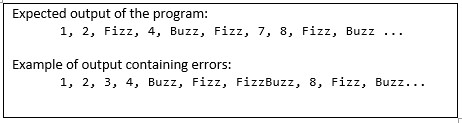

# Fizz Buzz Testing.

## Introduction:
Fizz Buzz is a simple application where the program prints numbers 1 to 100, where if a number is divisible by 3, instead, it should print Fizz and if the number is divisible by 5, the program should print Buzz.
Assume that some developer has developed a Fizz Buzz application (FizzBuzz.exe attached) and have released a version of the software. This software may contain “defects” when returning the values.

## Problem:
Develop a test program (preferably in python) that executes the FizzBuzz program automatically. This executable test should run the FizzBuzz “N” times, and at the end generate a log report, containing statistical data of the outputs. The test may also plot graphs of the obtained outputs, i.e. a histogram.  Present your defect report containing your analysis in a one-page slide.

## Deliverables:
Zip file named “<your_name>-hil-challenge-2021” with the following files:
- Script: “<your_name>-fizzBuzzTest”
- One-page report: “<your_name>-report”.pdf
## Observations:
- Running fizzBuzz.exe:
Open the command prompt on the file’s location and type: FizzBuzz.exe. The result will be printed on command window.
- Implementation:
Implement preferably in python. If you choose another language, inform prior turn in.
